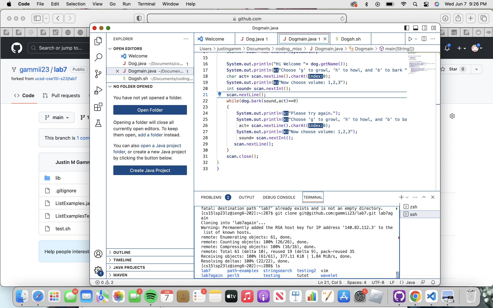

# ALL ABOUT VIM

<br/>

```bash
<up><enter>
```
This allowed to me to login to my ieng6 by accessing my bash history and using command ``` ssh cs15lsp23lz@ieng6.ucsd.edu```
<br/>


I typed ```git clone``` and then did ```<CTRL+C><CTRL+V><ENTER> lab7again``` I copied the ssh url of my fork. I then pasted it into the terminal and created a new directory for that clone.
<br/>

 
```<up><up><up><Enter>``` The command ```bash test.sh``` was 3 up in the bash history so then I accessed and ran the test using the up arrow and enter
<br/>


I scrolled down to the error then i did ```<x><i><2>``` I deleted 1 from index1 and inserted 2. This fixes the bug.
