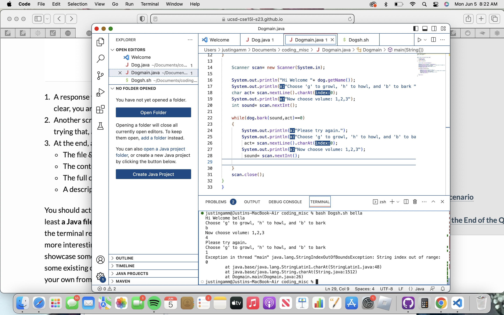

### Debugging and Reflection
 
1. EdStem Discussion
 
 

**Title: Unknown String index out of bounds error.**
 

**Category: Debugging**

 
a. I am using a Macbook air running Mac OS. I am using the visual studio code terminal.
 
 
b. So what was expected to happen is the loop keeps running until the user enters valid inputs. It will keep prompting the user and asking the user the same question until the inputs are valid.
 
 
c. I wanted to test out what it looks like when I enter invalid inputs. The program I created is a dog barking simulator. You pick either b,g,h for bark, growl, or howl, and then you choose between 1,2,3 for volume. I made sure that my bash script prints out the exit code and it is 1. Any help is appreciated. Thank you!
