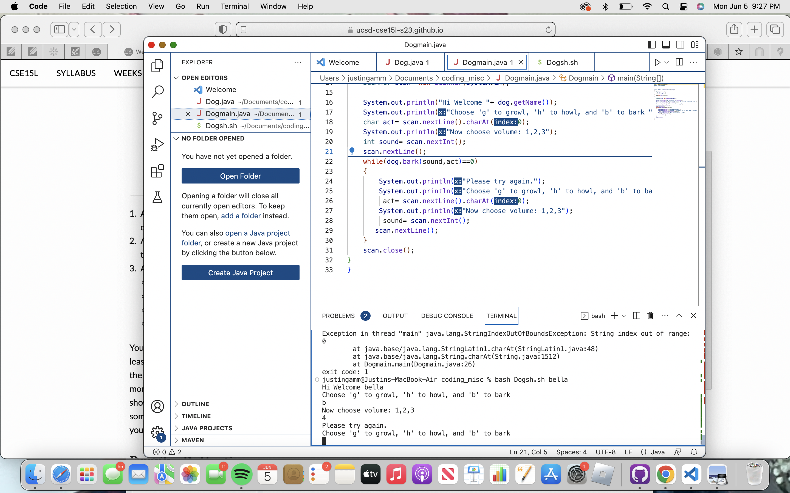

### Debugging and Reflection
<br/>
1. EdStem Discussion
<br/>
<br/>

**Title: Unknown String index out of bounds error.**
<br/>

**Category: Debugging**


<br/>
a. I am using a Macbook air running Mac OS. I am using the visual studio code terminal.
<br/>
<br/>
b. So what was expected to happen is the loop keeps running until the user enters valid inputs. It will keep prompting the user and asking the user the same question until the inputs are valid.
<br/>
<br/>
c. I wanted to test out what it looks like when I enter invalid inputs. The program I created is a dog barking simulator. You pick either b,g,h for bark, growl, or howl, and then you choose between 1,2,3 for volume. I made sure that my bash script prints out the exit code and it is 1. Any help is appreciated. Thank you!
<br/>
<br/>

**Justin Gamm: Hi, Im unsure what you other two code files are but from what I can see, I can suggest one thing without explicitly telling you what to do. Remember scanning for next Int only looks for an integer but you are also clicking the enter key when you input an int. Try dealing with the result of clicking enter. You cannot ignore it. Hope that helps.**
<br/>
<br/>



Thank you for the help, I was stuck on what to do and needed that. I see now all I had to do was take care of the empty space that resulted from clicking the enter key. I just needed to scan it so that the next scan doesn't read the empty space as the first character. Thank you.
<br/>
<br/>

All in all the structure I went for was to keep my three files in the same directory. The reason I did this was because I have one file that defines the dog class and another file that creates an instance of that class and runs the program. I needed the two files to be in the same directory to do this. The bash file is also in the same directory so when I compile the files I dont need to specifiy a long path in the bash script. The contents of each file was pretty much the same before fixing the bug. The only difference was I added to lines that scanned the enter key. To trigger the bug these were the command line imputs:
```bash  bash Dogsh.sh bella
Hi Welcome bella
Choose 'g' to growl, 'h' to howl, and 'b' to bark 
4
Now choose volume: 1,2,3
4
Please try again.
Choose 'g' to growl, 'h' to howl, and 'b' to bark 
Exception in thread "main" java.lang.StringIndexOutOfBoundsException: String index out of range: 0
        at java.base/java.lang.StringLatin1.charAt(StringLatin1.java:48)
        at java.base/java.lang.String.charAt(String.java:1512)
        at Dogmain.main(Dogmain.java:26)
exit code: 1
```

In the future if I encounter a similar bug I can remember to scan for characters that I would usually ignore.
<br/>
<br/>

**Category:Reflection**
The second half of Lab sections was mostly focused on autograder. This topic was quite annoying and frusturating. Thankfully my Tutor Andrew was very helpful and answered my plethora of questions. We would bring up stack overflow posts and chatgpt solutions to him and we would all look at it together and try to understand it together. One cool thing I learned was the use of substring in bash script. I had no clue you could take a substring of a line in a text file using command line arguments. I was trying to use regex first, chatgpt led me to this, and had no clue how to proceed. He looked at the code with use and tried to make sense of the regex but ultimately we came to the conclusion to use the substring method. It just baffles me how many possiblities there are with bash scripts. 
