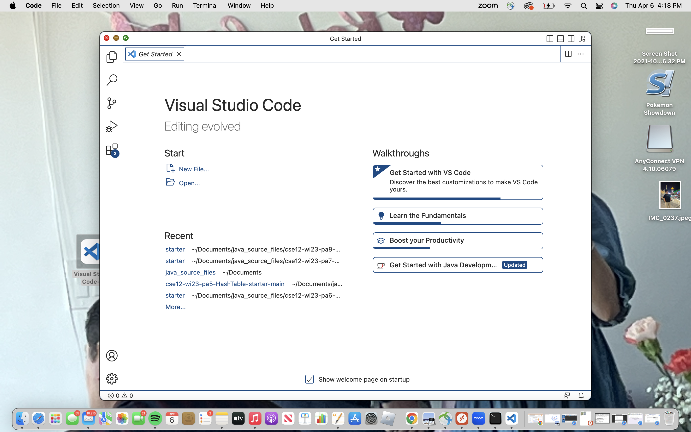
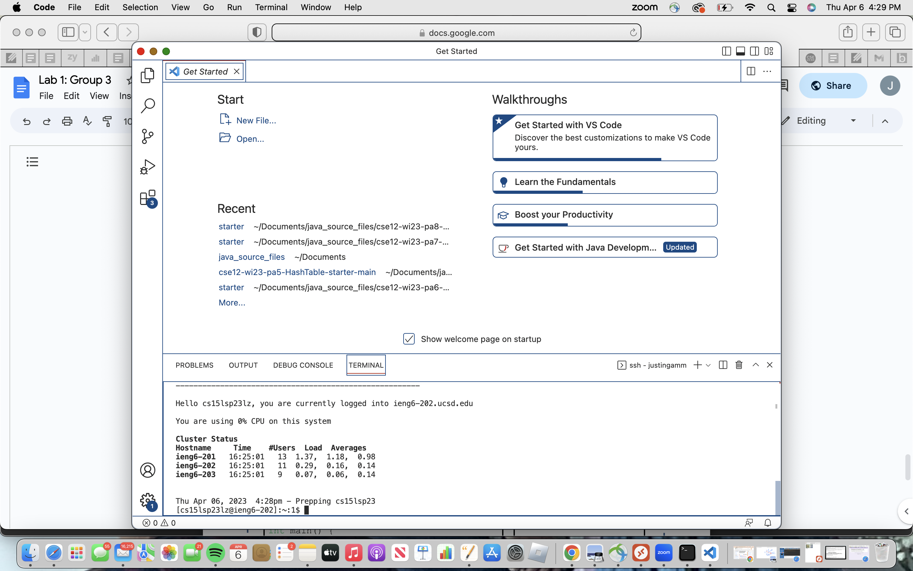
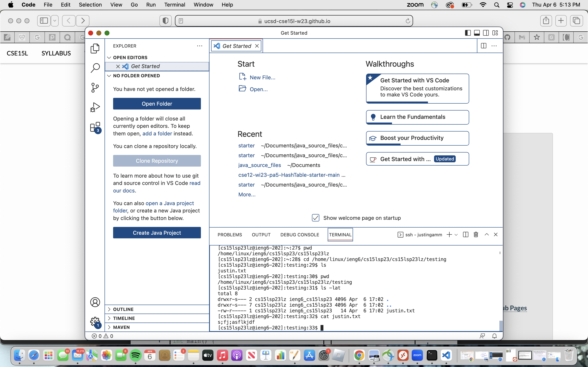

# Intro to CSE15L: Installing vscode, logging onto a remote server, using basic linux commands and more..

1) **Looking up Account**

   In order to log onto the remote server, you first need to look up your course specific account:

*  [Visit this link](https://sdacs.ucsd.edu/~icc/index.php)
*  You then just fill in the required fields. 
*  Once you fill in the required fields you will be redirected to another page. On that page there should be a section called "Additional Accounts", the account that starts with cse15lsp23 is your course specific account; save this somewhere.


2) **Installing VS code**

VS code is the IDE you will be working in for this class, as well as the place you will access terminal from. To download VS code and install it, [Visit this link](https://code.visualstudio.com/). Just look for your operating system in the download section and follow the instructions. When you are done you should be able to access a window that looks like this:




3) **Remotely Connecting**

In this class, you will need to remotely connect to a survey. First things first, if you are on windows [Visit this link](https://gitforwindows.org/) and [Visit this link](https://stackoverflow.com/a/50527994).

* Open terminal within VS code. (You can do this on mac by looking at the top of your screen and clicking terminal, then new terminal)
* Copy this command into terminal, but replace the last two characters with the last two characters of your course specific account:  
* ```js  ssh cs15lwi23zz@ieng6.ucsd.edu ```
* Say yes to the following question that comes up and enter your password for this account. *You might need to reset your password*.

**Your terminal should now look like this:**





4) **Exploring terminal commands**

Now just test out commands you learned in class and note what each one does.

**Here is an example:**



 Once I knew what directory I was in using ```pwd```, which prints out the working directory, I used the command ```mkdir testing``` which creates a new directory called testing. Of course there is nothing in there at that moment. I then did ```vim justin.txt```, and since that text file doesnt exist,it creates a new text file called justin.txt in my working directory (testing).


**Hopefully this tutorial was useful. Have fun testing out commands.**
